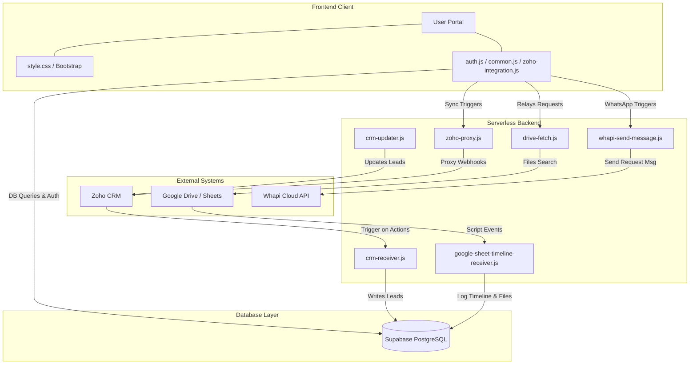

# Air Medical 24x7 Sales Operations Management System
# Comprehensive System Documentation & Pitch Deck

This document serves as both a **Business Pitch Deck** for stakeholders/investors and a **Technical Blueprint** for developers. It details the problem statement, business value proposition, system architecture, database schemas, and workflows of the **Air Medical 24x7 Sales Operations Management System (Sales Ops Dashboard)**.

---      

# PART I: EXECUTIVE PITCH & PRODUCT OVERVIEW

## 🎯 1. The Executive Summary
Air Medical 24x7 is a premier provider of international medical transport and tourism services. Coordinating air ambulance evacuations, commercial medical escorts, and complex patient relocations requires absolute precision, speed, and cross-departmental coordination. 

The **Sales Operations Management System** is a custom, enterprise-grade portal that connects frontline sales representatives, backend operations, and the accounts/finance department. By streamlining lead intake, enforcing compliance gates on invoicing, and automating logistics alerts, the platform drastically reduces operational friction and accelerates the lead-to-case lifecycle.

---

## ⚠️ 2. The Problem Statement
Frontline sales and medical coordinators face multiple systemic challenges:
1. **High-Friction Mobile Operations**: Frontline sales representatives are frequently in transit, hospital wards, or airports. Accessing massive, complex enterprise CRM systems (like Zoho CRM) on the go is slow, prone to errors, and hinders fast response times.
2. **Financial Invoicing Compliance Risks**: Medical transport requires strict invoicing. In a fast-paced environment, sales reps might bypass critical compliance gates (e.g., booking transports before obtaining deposits, or skipping proforma invoice reviews), causing financial leakage and auditing disputes.
3. **Communication Latency (Accounts vs. Sales)**: Sales reps rely on the billing/accounts team to generate Quotations, Proformas, Tax Invoices, and Payment Receipts. Traditional channels (email, phone calls, manual chat) introduce latency, causing critical delays in patient dispatch.
4. **Data Isolation & Duplicate Entry**: Reps manually copy lead details between private sheets, chat apps, and corporate CRM software, leading to duplicate records, mismatched information, and lost history logs.

---

## 💡 3. The Solution & Value Proposition
The **Sales Ops Dashboard** solves these pain points by offering a unified, high-performance, mobile-responsive console designed specifically for medical logistics:

*   **Frictionless Sales Interface**: A lightweight dashboard optimized for logging calls, scheduling hospital meetings, uploading expense receipts, and tracking leads on the go.
*   **Enforced sequential Document Compliance**: The system locks and tracks billing progress. Sales reps cannot request subsequent financial documents (like Tax Invoices) until preceding milestones (like Proforma Invoice confirmation) are finalized and downloaded.
*   **One-Click WhatsApp Billing Automation**: Integrates with WhatsApp (via Whapi Gateway) to instantly notify the Accounts team when a document is requested, automatically providing all case, location, patient, and routing details.
*   **Bi-Directional CRM Synchronization**: Keeps Zoho CRM in perfect sync with the app's local database. Inbound webhooks process leads immediately, while changes in the app sync back to Zoho instantly.

---

## 📈 4. Core Business Benefits (ROI)
*   **Reduced Dispatch Delays**: Instant WhatsApp document requests cut back-and-forth approval loops from hours to minutes—a critical benefit when coordinate life-saving flights.
*   **Zero-Leakage Financial Compliance**: By hardcoding the sequential workflow, the system guarantees that no flight is dispatched without invoice confirmation and deposit matching.
*   **Enhanced Team Accountability**: Integrates real-time clock-in/out attendance logs, geo-location inputs, expense reimbursement tracking with receipt verification, and call/meeting audits.
*   **Improved Sales Velocity**: Automatic Zoho CRM syncing ensures that duplicate leads are filtered out and assigned immediately, maximizing sales team output.

---

# PART II: TECHNICAL BLUEPRINT & INTEGRATION

## 🛠️ 5. Technical Architecture Overview
The system uses a decoupled, modern architecture. The client-side dashboard queries the **Supabase (PostgreSQL)** database directly for speed, using **Row-Level Security (RLS)** to partition data. Serverless **Netlify Functions** manage secure OAuth tokens, file retrieval from Google Drive, and API integrations with Zoho and WhatsApp.



---

## 🗄️ 6. Supabase Database Schema (Entity Relationship)

The database utilizes PostgreSQL tables with configured indexes and triggers.

### Table Descriptions & Columns

#### 1. `users`
Tracks user profiles linked directly to Supabase Auth.
*   `id` (UUID, Primary Key): References `auth.users(id)`.
*   `email` (TEXT, Unique): User's primary email.
*   `name` (TEXT): Full display name.
*   `designation` (TEXT): Job title.
*   `contact` (TEXT): Phone number.
*   `role` (TEXT, Default: 'user'): Role level (`admin` or `user`).
*   `created_at` (TIMESTAMPTZ): Signup timestamp.
       
#### 2. `user_details`
Extended user metadata and personalization options.
*   `id` (UUID, Primary Key): Unique row identifier.
*   `user_id` (UUID): References `users(id)` (Unique, Cascade delete).
*   `name` / `designation` / `contact` / `email` (TEXT): Copied profile properties.
*   `updated_at` (TIMESTAMPTZ): Last update timestamp.

#### 3. `leads`
Main repository of potential business cases, client information, and patient logistics.
*   `id` (UUID, Primary Key): Database identifier.
*   `user_id` (UUID): Assigned sales representative (references `users(id)`).
*   `name` (TEXT): Lead contact name (usually patient or organizer).
*   `contact` (TEXT): Primary phone.
*   `email` (TEXT): Primary email.
*   `owner` (TEXT): Descriptive owner name.
*   `status` (TEXT): Pipeline state (`New`, `In Progress`, `Qualified`, `Closed`, `Not Converted`).
*   `follow_up_date` (DATE): Scheduled callback date.
*   `next_action` (TEXT): Note on what to do next.
*   `expected_close` (DATE): Estimated deal closing date.
*   `lead_source` (TEXT): Origin of the lead (e.g., Whatsapp, Hospital, Website).
*   `field` (TEXT): Service division (e.g., Air Ambulance, Commercial Escort).
*   `patient_name` (TEXT): Target patient's name.
*   `client_relation` (TEXT): Relationship between paying client and patient.
*   `source_location` (TEXT): Patient pick-up location.
*   `destination_location` (TEXT): Patient drop-off hospital/location.
*   `zoho_lead_id` (VARCHAR): Unique lead ID in Zoho CRM.
*   `serial_no_1` (TEXT): Zoho flow primary tracking reference.
*   `serial_no_2` (TEXT): Unique generated 6-digit dashboard sequence.
*   `is_converted` (BOOLEAN): Flag indicating if converted to a case.
*   `converted_at` (TIMESTAMPTZ): Date/time of case conversion.
*   `converted_case_id` (UUID): References `cases(id)`.
*   `vendor_id` (UUID): Associated service vendor (references `vendors(id)`).
*   `lead_date` (DATE): Date the lead was received (default: current date).
*   `created_at` (TIMESTAMPTZ): Creation timestamp.

#### 4. `cases`
Confirmed cases transitioned from converted leads.
*   `id` (UUID, Primary Key): Unique case identifier.
*   `case_number` (TEXT, Unique): Formatted string (e.g. `CASE-123456`).
*   `lead_id` (UUID): References original `leads(id)`.
*   `user_id` (UUID): Managed by representative (references `users(id)`).
*   `title` (TEXT): Title of the transport.
*   `description` (TEXT): Medical condition, details, flight parameters.
*   `status` (TEXT): Current state (`Pending`, `In Progress`, `Completed`, `On Hold`, `Cancelled`).
*   `priority` (TEXT): Response priority (`Low`, `Medium`, `High`).
*   `proforma_uploaded` (BOOLEAN): Status of proforma invoice receipt.
*   `invoice_requested` (BOOLEAN): Status of tax invoice request.
*   `invoice_uploaded` (BOOLEAN): Status of tax invoice receipt.
*   `receipt_uploaded` (BOOLEAN): Status of payment receipt.
*   `created_at` / `updated_at` (TIMESTAMPTZ): Metadata audit timestamps.

#### 5. `case_files` / `case_invoices` / `case_receipts`
Track document uploads associated with a case.
*   `id` (UUID, Primary Key): Identifier.
*   `case_id` (UUID): References `cases(id)`.
*   `file_name` (TEXT): Name of file.
*   `file_url` (TEXT): Storage URL (Google Drive URL).
*   `file_size` (BIGINT): File footprint in bytes.
*   `storage_path` (TEXT): Bucket indicator or `drive_sync` label.
*   `uploaded_by` (UUID): References `users(id)`.
*   `uploaded_at` (TIMESTAMPTZ): Timestamp.

#### 6. `attendance`
Maintains check-in and check-out tracking for payroll and metrics.
*   `id` (UUID, Primary Key): Row identifier.
*   `user_id` (UUID): References `users(id)`.
*   `date` (DATE): Calendar date.
*   `clock_in` (TIME): Clock in timestamp.
*   `clock_out` (TIME): Clock out timestamp.
*   `hours_worked` (DECIMAL): Daily total hours worked.
*   `created_at` (TIMESTAMPTZ): Entry timestamp.

#### 7. `calls`
Frontline call logger.
*   `id` (UUID, Primary Key): Log identifier.
*   `user_id` (UUID): References `users(id)`.
*   `name` (TEXT): Contact person.
*   `phone` (TEXT): Phone number.
*   `designation` (TEXT): Role of the contact.
*   `hospital_name` (TEXT): Location associated with contact.
*   `call_date` (DATE): Date of call.
*   `created_at` (TIMESTAMPTZ): Creation audit.

#### 8. `meetings`
Hospital visit and client meeting log.
*   `id` (UUID, Primary Key): Log identifier.
*   `user_id` (UUID): References `users(id)`.
*   `meeting_with` (TEXT): Name of person/stakeholder.
*   `client_name` (TEXT): Associated client account.
*   `agenda` (TEXT): Subject of meeting.
*   `outcome` (TEXT): Result details or next items.
*   `meeting_date` (DATE): Calendar date of meeting.
*   `created_at` (TIMESTAMPTZ): Creation timestamp.

#### 9. `expenses`
Reimbursement ledger.
*   `id` (UUID, Primary Key): Expense ID.
*   `user_id` (UUID): References `users(id)`.
*   `category` (TEXT): Expense type (e.g. Travel, Dining, Supplies).
*   `amount` (NUMERIC): Cost value.
*   `currency` (TEXT): `INR` or `AED` options.
*   `date` (DATE): Transaction date.
*   `description` (TEXT): Detail of expense.
*   `receipt_url` (TEXT): Public URL of receipt image/PDF.
*   `status` (TEXT): Workflow status (`pending`, `approved`, `rejected`).
*   `admin_note` (TEXT): Audit explanation by reviewing admin.
*   `is_deleted` (BOOLEAN): Soft delete flag.
*   `created_at` / `updated_at` (TIMESTAMPTZ): Audit records.

#### 10. `vendors`
Third-party transport and service vendors directory.
*   `id` (UUID, Primary Key): Vendor ID.
*   `name` (TEXT): Primary Vendor Name.
*   `org_name` (TEXT): Corporate entity.
*   `contact_person` (TEXT): Lead agent at vendor.
*   `phone` / `email` / `address` / `notes` (TEXT): Contact credentials.
*   `status` (TEXT): `Active` or `Inactive` switch.
*   `created_by` (UUID): References `users(id)`.
*   `created_at` / `updated_at` (TIMESTAMPTZ): Metadata timestamps.

---

## ⚡ 7. Serverless Netlify Functions

Located in `netlify/functions/`, these modules handle secure operations:

1.  **`crm-receiver.js`**: Inbound Zoho webhook. Maps incoming lead payloads to Supabase `leads`. Includes conflict resolution (lookup by Zoho ID, email, or phone) and strips null values on updates to preserve existing quotation IDs.
2.  **`crm-updater.js`**: Outbound Zoho webhook. Uses a saved `ZOHO_REFRESH_TOKEN` to generate temporary access tokens and updates lead records in Zoho CRM via PUT requests.
3.  **`drive-fetch.js`**: Scans Google Drive folders (mapped for quotations, proformas, invoices, and receipts) for PDF files matching a specific `quotationId`. Returns a direct view link (`https://drive.google.com/file/d/{id}/view`).
4.  **`google-sheet-timeline-receiver.js`**: Receives webhooks from Google Sheets/Apps Script when files are uploaded/updated, writing to `lead_history`, updating case files (`case_files`, `case_invoices`, `case_receipts`), and toggling document status flags.
5.  **`whapi-send-message.js`**: Connects to the WhatsApp Gateway (Whapi Cloud API) to send formatted document requests directly to the Accounts team.
6.  **`zoho-proxy.js`**: Acts as a proxy for client-side API requests to Zoho endpoints, resolving CORS limitations.

---

## 🗒️ 8. Google Sheets Apps Script Integration (`Code.gs`)
The system retains integration with a central Google Sheets workbook for reporting and synchronization. The script `Code.gs` runs on Google Sheets, exposing web app endpoints (`doGet` / `doPost`):
*   **Legacy User & Attendance Logs**: Tracks logs inside user-dedicated sheet tabs.
*   **Signup Logger**: Appends registration data into the `SIGNUP_LOGS` sheet tab.
*   **Quotation Precision Merge**: 
    1. Sales reps create a quotation request in the dashboard, appending a temporary row (with `serial_no_2` and client name) to the Google Sheet.
    2. The pricing team creates a quotation via Zoho CRM, creating a row with a `Quote_ID` but no tracking serial.
    3. The Apps Script runs `getQuotationBySerial`, matches the temporary row with the Zoho record using name-similarity checks, merges `serial_no_2` into the Zoho row, and deletes the temporary row to keep the sheet clean.

---

## 🚀 9. Setup & Installation Guide

### Prerequisites
1.  **Node.js**: Installed (version 18+ recommended).
2.  **Supabase Project**: An active PostgreSQL instance.
3.  **Zoho CRM**: Developer console access.
4.  **Whapi Cloud Account**: Active WhatsApp API channel.
5.  **Google Workspace**: A Google Sheet and folder structure on Google Drive.

### Environment Configuration (`.env`)
Create a `.env` file in the root directory:
```ini
# Supabase
SUPABASE_URL=https://your-supabase-id.supabase.co
SUPABASE_ANON_KEY=your-anon-public-key
SUPABASE_SERVICE_ROLE_KEY=your-service-role-key

# Zoho CRM
ZOHO_CLIENT_ID=your-zoho-client-id
ZOHO_CLIENT_SECRET=your-zoho-client-secret
ZOHO_REFRESH_TOKEN=your-zoho-refresh-token
ZOHO_REGION=in # e.g. in, eu, com

# Google Drive
GOOGLE_DRIVE_API_KEY=your-google-drive-api-key

# Whapi Cloud (WhatsApp API Gateway)
WHAPI_API_TOKEN=your-whapi-token
WHAPI_ACCOUNTS_PHONE=919876543210 # Accounts team destination phone number

# Security Handshake
WEBHOOK_SECRET=SALES_OPS_2026_SECURE
```

### Local Dev Launch
1.  Install dependencies:
    ```bash
    npm install
    ```
2.  Start the development server:
    ```bash
    npm run dev:local
    ```
    *This runs `dev-server.js` on port `8888`, serving static client files and emulating Netlify Functions locally.*
3.  Open `http://localhost:8888` in your browser.

---

# PART III: PRODUCT ROADMAP & SCALING POTENTIAL

## 🔮 10. Future Milestones & Scaling
To further expand the commercial viability of this product, the following features are planned:
1.  **Automated PDF Generation**: Generate customized Quotations and Proforma Invoices directly inside the app using client and patient data templates, removing the need for manual Google Drive uploads.
2.  **Interactive Medical Dispatch Map**: A real-time geolocation dashboard displaying active patient transport coordinates, aircraft statuses, and vendor locations using map APIs.
3.  **Power BI / Tableau Connector**: Pre-build dashboard templates to push pipeline statistics directly into advanced business intelligence tools.
4.  **Unified Messaging Center**: Consolidate WhatsApp, SMS, and email threads with clients and hospital coordinators directly inside each Case page.

---
*Maintained by the Air Medical 24x7 Engineering Team*
*Document Version: v3.2 (Pitch Ready)*
